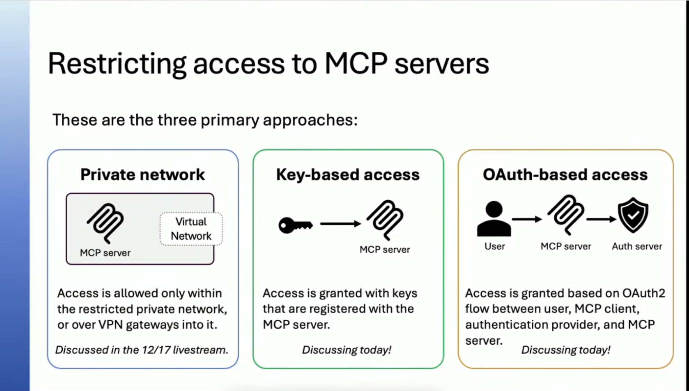
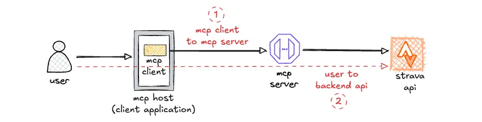
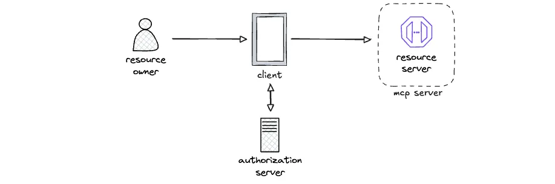

# MCP

[Model Context Protocol](https://www.anthropic.com/news/model-context-protocol)

## OAuth 2.1

OAuth 2.1 is the latest version of the OAuth protocol, which provides a secure way for applications to access resources on behalf of a user. It builds upon OAuth 2.0 with additional security features and best practices.

The MCP server plays the role of a resource server in the OAuth 2.1 framework. It is responsible for validating access tokens and providing access to protected resources based on the scopes granted to the client application.
The resource server is a role in OAuth 2 that the application is trying to get data from. doesn't necessarly have to be an API, it can be a database or any other resource that the application needs to access on behalf of the user.

An authorization server is describing a role in the OAuth 2.1 framework that is responsible for issuing access tokens to client applications after successfully authenticating the resource owner and obtaining authorization. The authorization server validates the client's credentials, authenticates the resource owner, and issues access tokens with specific scopes that define the level of access granted to the client application. it is mainly responsible for issuing tokens and interacting with the user. it is not responsible for authenticating the user because that is something it can do, but doesn't technically have to do. it can delegate that responsibility to another service, like a SSO provider. if the authorization server is federated out to another server. Say you are using the company's slack and have slack web and click login, the slack server is the authorization server and it is federated out to the company's SSO provider. The SSO provider is the one that authenticates the user and then returns a token to slack, which then issues its own token to the client application.

## what does interacting with the user mean?
 it means that the authorization server is responsible for presenting the user with a login page, consent page, and any other user interface that is necessary for the user to authorize the client application. it is also responsible for handling the user's input and returning the appropriate response to the client application. `but if it is federated out to another server`, then it is not responsible for authenticating the user. it is only responsible for issuing tokens and interacting with the user. it can delegate the responsibility of authenticating the user to another service, like a SSO provider. in this case, it is still interacting with the user by presenting the user with a login page that has a button that says "Login with SSO". when the user clicks that button, the authorization server redirects the user to the SSO provider's login page. The SSO provider authenticates the user and returns a token to the authorization server, which then issues its own token to the client application. The client application would then use that token to access the resource server.

By decoupling these architectures, developers can use production-ready, off-the-shelf identity infrastructure (like Okta, Keycloak, or Entra ID) to handle user login, while keeping the MCP server focused purely on delivering data.

[Enterprise-Grade Security for the Model Context Protocol (MCP): Frameworks and Mitigation Strategies](https://arxiv.org/pdf/2504.08623)

There’s two places in the request flow where OAuth2 is relevant: 
- 1/ MCP client to MCP server
- 2/ user via MCP host to backend APIs

MCP server to use the token exchange flows to act on-behalf-of the user.

## An example scenario using token exchange flow

An organisation has a plethora of REST APIs that they have built over the years and would like to expose them via MCP servers. The API's are protected by JWT bearer auth and they have existing OAuth Authorization servers. The easiest path for adopting MCP would be to leverage their existing auth solution and treating the MCP server as just another middle tier service that needs to consume their existing APIs.

## RFC 8693: Token Exchange
The Token Exchange extension defines a mechanism for a client to obtain its own tokens given a separate set of tokens. This has several different applications including:
- Single-sign-on between multiple mobile apps without launching a web browser
- A resource server exchanging a client's tokens for its own tokens

Native SSO: Desktop and Mobile Apps Single-Sign-On (developer.okta.com)
How to Create a Seamless Mobile SSO (Single Sign-On) Experience in iOS (developer.okta.com)

## OpenID Connect Native SSO for Mobile Apps
The Native SSO spec was created specifically to solve the "SSO between apps without a browser" problem, and it does so by requiring OAuth 2.0 Token Exchange (RFC 8693) as its core mechanism. 

Single-app vendors are not concerned with this OpenID Connect extension for device-based single sign-on (SSO) as it relies on the sharing of an ID token and a device-bound secret between the applications participating in the SSO. This requires a level of trust between the apps that is only practical when they belong to the same vendor.

OpenID Connect Native SSO relies on two credentials – a device session secret and an ID token, that the vendor’s apps must store in a location accessible only to them. Other apps or users on the device must not have the means to access these credentials. If they do, there is risk of impersonation and illegitimate access to protected APIs of the app vendor.

## I was wondering since the feature that enables native SSO exists, can we then use it to make mobile clients have secrets?

Mobile apps are still public clients (per RFC 8252) with no client secret, even though Native SSO requires secure, app-restricted storage. The existence of secure storage (iOS Keychain access groups, Android storage restricted by signing key) doesn't change why client secrets are unsafe for native apps — it solves a different, narrower problem.

The actual problem RFC 8252 cares about: a `client_secret` must be the same value in every copy of the app. That means it has to be embedded in the distributed binary — and any single user, anywhere, can extract it (jailbreak/root the device, decompile the app, intercept it during a debug session, etc.). Once one person extracts it, the secret is worthless as a secret for the entire population of app installs

Native SSO's secure-storage requirement is about isolating a per-device, per-session, rotatable credential from other apps/users on that device

Why native apps can't hold a client secret. A `client_secret` is a static credential baked in at build time and shared by every installation of the app. Anyone can download the APK/IPA, decompile it, and extract the secret — so it authenticates nothing. RFC 8252 (OAuth for Native Apps) and the OAuth 2.0 Security BCP therefore classify native apps as public clients: the authorization server should not rely on a client secret from them, and issuing one adds no security. PKCE is what replaces it for the authorization code flow.

The device secret is not a client secret. The Native SSO `device_secret` differs on every axis that made the client secret useless:

- It's issued at runtime by the authorization server, per device and per user session — not embedded in the binary, and not shared across installations.
- It's stored in OS-protected shared storage scoped to one vendor's apps — iOS keychain access groups / app groups, Android AccountManager or storage shared between apps signed with the same key. That's the "location accessible only to them" your quoted text refers to.
- It's revocable and rotatable — the AS can kill one device's session without affecting anything else.
- It authenticates the device session, not the client software. In the token exchange grant (`urn:ietf:params:oauth:grant-type:token-exchange`), the second app presents the `device_secret` plus the ID token as proof that this device already has an authenticated session — the app itself is still a public client, typically with no client authentication at all.

One nuance: a native app can end up with a usable per-instance credential via dynamic client registration (RFC 7591) — each installation registers itself and receives its own secret or, better, its own key for `private_key_jwt`. That's legitimate because compromise of one install exposes only that install. T FAPI 2.0 requires confidential clients (mTLS or `private_key_jwt`), so a FAPI-compliant native app effectively must use per-instance credentials — usually dynamic registration combined with app attestation — never a shared embedded secret

[openid-connect-native-sso](https://connect2id.com/learn/openid-connect-native-sso)

OpenID Connect has become the de-facto internet standard for single sign-on and identity provisioning. Client applications, called relying parties (RP), receive the user’s identity in a digitally signed object called ID token. Additional details about the user, called claims, can also be requested and if consented and available the OpenID provider puts them up for retrieval in JSON or signed JWT format at its UserInfo endpoint, in exchange for an access token

To support the provision of verified identities the core OpenID Connect protocol is extended in two places:
- A `verified_claims` element is defined for the optional claims OpenID authentication request parameter.
- A `verified_claims` element, or container, is defined for the ID token or UserInfo to return the verified claims and data about the verification itself.
